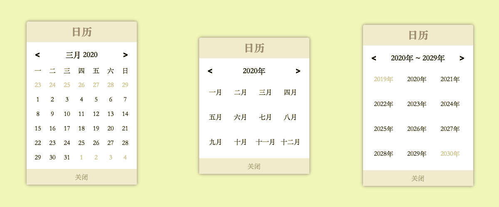

# [calendar-dialog](https://hai2007.github.io/calendar-dialog)
一个日历弹框，可以通过此日历组件选择日期、时间和标记日程等，支持多种主体，可配置化的设计思想；代码采用模块化开发，易于理解，可以很方便的进行二次开发。

  
  
  
  

## Issues
使用的时候遇到任何问题或有好的建议，请点击进入[issue](https://github.com/hai2007/calendar-dialog/issues)！

## How to use?

具体的使用你可以[查阅文档](https://hai2007.github.io/calendar-dialog)哦~

开源协议
---------------------------------------
[MIT](https://github.com/hai2007/calendar-dialog/blob/master/LICENSE)

Copyright (c) 2021 [hai2007](https://hai2007.gitee.io/sweethome/) 走一步，再走一步。
